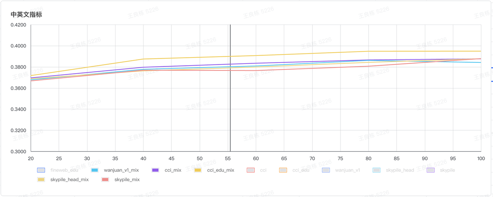
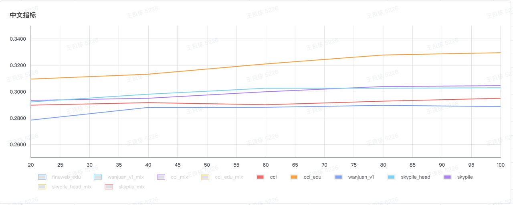

# Dataset curation
A new method for filtering LLM training datasets uses synthetic data to develop classifiers for identifying educational content. This approach was applied in training LLama3 and Phi3, though its large-scale effect on web data filtering remains underexplored.

The popular Phi3 models, trained on 3.3 and 4.8 trillion tokens, used "heavily filtered public web data (by educational level) and synthetic LLM-generated data." Similarly, the LLama3 team leveraged Llama 2 to build text-quality classifiers for Llama 3. However, these classifiers and filtered datasets are not publicly available.

To improve the quality of Chinese corpora, we followed [Fineweb-edu's](https://huggingface.co/datasets/HuggingFaceFW/fineweb-edu) approach and developed an educational quality classifier with annotations from Qwen2-72B-Instruct to build the [CCI3-HQ](https://huggingface.co/datasets/BAAI/CCI3-HQ) dataset.

## Annotation
We used Qwen2-72B-Instruct to score 145,000 pairs of web samples and their scores from 0 to 5, generated by Qwen2. The samples were annotated based on their educational quality with 0 being not educational and 5 being highly educational. 

The prompt used for annotation mostly reuses [FineWeb-edu prompt](./prompt.txt). You can use [qwen2_api](./qwen2_api.py) to request an already deployed API (such as one using vLLM) for annotation.

## Classifier training
The classifier was trained on We added a classification head with a single regression output to [BGE-M3](https://huggingface.co/BAAI/bge-m3) and trained the model for 20 epochs with a learning rate of 3e-4. During training, the embedding and encoder layers were frozen to focus on the classification head and dropout was not used. The model achieved an F1 score of 73% when converted to a binary classifier using a score threshold of 3. [Training script](./run_classification_trainval.sh) is provided here.

The classifier is available at: https://huggingface.co/BAAI/cci3-hq-classifier

## Evaluation and results
### Setup
Due to the mixed Chinese and English datasets, we chose Qwen2-0.5B model for datasets evaluation, each experiment with 100B tokens training. 

We follow the same evaluation setup for all models using [FineWeb setup](https://github.com/huggingface/cosmopedia/tree/main/evaluation) with [lighteval](https://github.com/huggingface/lighteval) library.
You can checkout the [evaluation script](./lighteval_tasks_v2.py) here.

### Results
We conducted two types of experiments:
1. Mixed Dataset Experiment: The ratio of English, code, and Chinese is 60% : 10% : 30%.
2. Chinese Dataset Experiment: The Chinese ratio is 100%.

For English datasets, we uniformly used [FineWeb-edu](https://huggingface.co/datasets/HuggingFaceFW/fineweb-edu/tree/main/sample/100BT). For code data, we used [StarCoder](https://huggingface.co/bigcode/starcoder). 
For Chinese datasets, we selected [wanjuan-v1](https://github.com/opendatalab/WanJuan1.0), [skypile](https://huggingface.co/datasets/Skywork/SkyPile-150B), and [cci3.0](https://huggingface.co/datasets/BAAI/CCI3-Data).

In the plots below, cci_edu datasets is from [CCI 3.0 HQ Dataset](https://data.baai.ac.cn/details/BAAI-CCI3-HQ).

For Mixed Dataset Experiment all evaluation metrics are averaged.

For Chinese Dataset Experiment only chinese evaluation metrics are averaged.

## References
1. https://huggingface.co/datasets/HuggingFaceFW/fineweb-edu
2. https://huggingface.co/HuggingFaceFW/fineweb-edu-classifier

