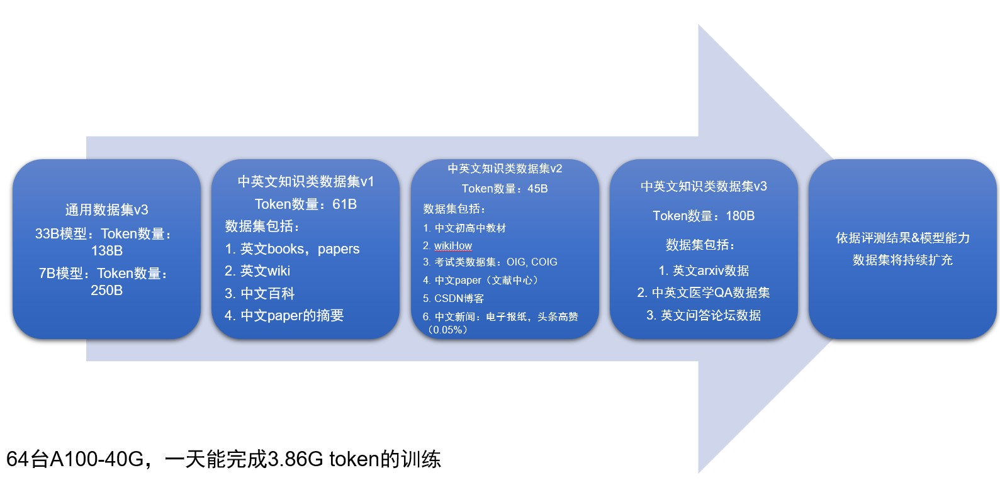

license: [Apache License 2.0](https://model.baai.ac.cn/use-agreement)


# AquilaChat-33B

## 简介/Overview
Aquila语言大模型在技术上继承了GPT-3、LLaMA等的架构设计优点，替换了一批更高效的底层算子实现、重新设计实现了中英双语的tokenizer，升级了BMTrain并行训练方法，在Aquila的训练过程中实现了比Magtron+DeepSpeed zero-2将近８倍的训练效率。Aquila语言大模型是在中英文高质量语料基础上从０开始训练的，通过数据质量的控制、多种训练的优化方法，实现在更小的数据集、更短的训练时间，获得比其它开源模型更优的性能。也是首个支持中英双语知识、支持商用许可协议、符合国内数据合规需要的大规模开源语言模型。

The Aquila language model inherits the architectural design advantages of GPT-3 and LLaMA, replacing a batch of more efficient underlying operator implementations and redesigning the tokenizer for Chinese-English bilingual support. It upgrades the BMTrain parallel training method, achieving nearly 8 times the training efficiency of Magtron+DeepSpeed ZeRO-2 in the training process of Aquila. The Aquila language model is trained from scratch on high-quality Chinese and English corpora. Through data quality control and various training optimization methods, it achieves better performance than other open-source models with smaller datasets and shorter training times. It is also the first large-scale open-source language model that supports Chinese-English-Knowledge, commercial licensing, and complies with domestic data regulations.
  
Aquila-33B模型由智源研究院研发，其在主流评测数据集上的评测结果如下

AquilaChat-33B model was developed by Beijing Academy of Artificial Intelligence. The evaluation results on mainstream benchmark datasets are as follows:

| 名称/Name | MMLU_Chinese_EM | CLUE-EM |MMLU-EM| BoolQ-EM| TruthfulQA-EM |IMDB-EM| RAFT-EM|
|  -----  | ----  | -----  | ----  | -----  | ----  | -----  | -----  |
| [Acuila-33B](https://model.baai.ac.cn/model-detail/xxxxx) | 0.292 | 0.385|0.269 | 0.731|0.347 |0.939| 0.443|
| [BiLLa-7B-LLM](https://model.baai.ac.cn/model-detail/xxxxx) | 0.279 | 0.374|0.257 | 0.76|0.205 |0.864| 0.514|
| [Ziya-LLaMA-13B-v1](https://model.baai.ac.cn/model-detail/xxxxx) | 0.273 | 0.404|0.406 | 0.786|0.284 |0.762| 0.191|

您可以在[FlagEval基础模型评测平台](https://flageval.baai.ac.cn/#/home) 查看更多评测指标

You can view [FlagEval Model Evaluation Platform](https://flageval.baai.ac.cn/#/home) for more details


我们的模型也同时支持[Huggingface平台](hflink)

We also support [Huggingface](hflink)


## 模型细节/Model details

我们使用了一系列更高效的底层算子来辅助模型训练，其中包括参考[flash-attention](https://github.com/HazyResearch/flash-attention)的方法并替换了一些中间计算，同时还使用了RMSNorm。在此基础上，我们应用了[BMtrain](https://github.com/OpenBMB/BMTrain)技术进行轻量化的并行训练，该技术采用了数据并行、ZeRO（零冗余优化器）、优化器卸载、检查点和操作融合、通信-计算重叠等方法来优化模型训练过程。

Aquila模型所采用的tokenizer是由我们从头开始训练的，支持中英双语。与其他tokenizer的参数对比见下表:

我们在处理英文、中文以及代码数据时，采用了不同的分词器对一万个样本进行了抽取。随后，我们统计了每个样本的token数量，并将其记录在表格中。


We used a series of more efficient low-level operators to assist with model training, including methods referenced from [flash-attention](https://github.com/HazyResearch/flash-attention) and replacing some intermediate calculations, as well as using RMSNorm. Building upon this foundation, we applied the [BMtrain](https://github.com/OpenBMB/BMTrain) for lightweight parallel training, which utilizes methods such as data parallelism, ZeRO (zero redundancy optimizer), optimizer offloading, checkpoint and operation fusion, and communication-computation overlap to optimize the model training process.

The tokenizer used in the Aquila model was trained from scratch by us and supports both English and Chinese. The parameters of this tokenizer are compared to those of other tokenizers in the table below:

We used different tokenizers to extract ten thousand data samples from English, Chinese, and code data respectively, obtained the count of tokens for each sample, and also included it in the table.

| 模型/Model | 词表大小/Vocab size | 说明/Note |英文平均tokens量/Avg tokens(English)| 中文平均tokens量/Avg tokens(Chinesse)|代码平均tokens量/Avg tokens(code)  |
|  -----  | ----  | -----  | ----  | -----  | ----  | 
| gpt2 | 50527 | bpe|1717 | 1764|2323 |
| llama | 32000 | sp(bpe)|1805| 1257|1970 |
| gpt2_new_100k | 100000 | bpe|1575 | 477|1679 |


## 训练数据集/Training data 

我们采用了一系列高质量中英文数据集来训练和微调我们的对话语言模型，并且在不断更新迭代

We used a series of high-quality Chinese and English datasets to train and fine-tune our conversational language model, and continuously updated it through iterations.




## 使用方式/How to use

### 1. 预训练/Pre-training
#### Step 1: 修改参数/Modify Parameters

* `cd /examples/aquila/aquila-pretrain`
* 配置`hostfile`文件, 参考[这里](../../../doc_zh/TUTORIAL_8_ENVIRONMENT_SETUP.md#a配置hostfilehostfile-中的v100-1-与sshconfig-对应) ; Configure the `hostfile` file, refer to [here](../../../docs/TUTORIAL_8_ENVIRONMENT_SETUP.md)
* 配置`bmtrain_mgpu.sh`文件, 将`SCRIPT_FILE`改成`aquila_pretrain.py`; configure the `bmtrain_mgpu.sh` file, change `SCRIPT_FILE` to `aquila_pretrain.py`
* 在`Aquila-pretrain.yaml`文件里更改参数 (可选)
* 我们的演示数据集放在`../indexed_dataset/data/demo_text_document`里。 如果想修改预训练数据集，可更改`aquila_pretrain.py`里的`data_prefix`参数          
#### Step 2: 启动训练/Start training
```
bash dist_trigger_docker.sh hostfile aquila-pretrain.yaml aquila-30b [实验名]
```   
接下来会输出下列信息，注意`NODES_NUM`应该与节点数相等，`LOGFILE`是模型运行的日志文件；The following information will be output. Note that `NODES_NUM` should be equal to the number of nodes, and `LOGFILE` is the log file for the model run.


成功训练之前能看到如下信息(具体参数可能不同)； Before successful training, you may see the following information with parameters that may differ:


  
### 2. 可监督微调/Supervised Fine-tuning(SFT)
#### Step 1: 修改参数
* `cd /examples/aquila/aquila-pretrain`
* 配置`hostfile`文件, 参考[这里](../../../doc_zh/TUTORIAL_8_ENVIRONMENT_SETUP.md#a配置hostfilehostfile-中的v100-1-与sshconfig-对应) ; Configure the `hostfile` file, refer to [here](../../../docs/TUTORIAL_8_ENVIRONMENT_SETUP.md)
* 配置`bmtrain_mgpu.sh`文件, 将`SCRIPT_FILE`改成`aquila_pretrain.py`; configure the `bmtrain_mgpu.sh` file, change `SCRIPT_FILE` to `aquila_pretrain.py`
* (可选) 在`Aquila-pretrain.yaml`文件里更改参数 ; (optional) change parameters in `Aquila-pretrain.yaml`

| 参数名 Parameter             | 类型 Type | 描述 Description                                        |
|--------------------------------|------------|-------------------------------------------------------|
| batch_size | int   | 每次迭代训练时，从数据集中抽取的样本数。一般来说，它越大，处理速度越快，但会占用更多的内存; The number of samples extracted from the dataset for each iteration during training. Generally, a larger batch size can speed up processing but may also consume more memory                    |
| gradient_accumulation_steps | int   | 在更新模型权重之前，要对多个小批次进行梯度计算的次数。主要应用于GPU显存较小的情况下，可以使用小的batch_size，通过梯度累积达到与大batch_size相同的效果; The number of samples extracted from the dataset for each iteration during training. Generally, a larger batch size can speed up processing but may also consume more memoryimages                  |
| lr | float   | 指控制模型更新参数时的步长或速率。学习率过高可能导致模型不收敛，而学习率过低则可能导致训练时间过长或者陷入局部最优解; The step size or rate at which the model updates its parameters during training. A high learning rate may cause the model not to converge, while a low learning rate may result in long training times or being stuck in a local optimum                  |
| warm_up | float   | 初始学习率与原始学习率的比例; The ratio between the initial learning rate and the original learning rate
| save_interval | int  | 模型保存的间隔，即每训练多少个iteration保存一次模型。当训练时间较长时，保存间隔可以避免因突然中断或出现错误导致训练成果全部丢失; The interval at which the model is saved, i.e., how often the model is saved per epoch during training. When training takes a long time, saving intervals can prevent all training achievements from being lost due to sudden interruptions or errors.   

#### Step 2: 启动微调
```
bash dist_trigger_docker.sh hostfile aquila-sft.yaml aquila-7b [实验名]
```
接下来会输出下列信息，注意`NODES_NUM`应该与节点数相等，`LOGFILE`是模型运行的日志文件；The following information will be output. Note that `NODES_NUM` should be equal to the number of nodes, and `LOGFILE` is the log file for the model run.


成功训练之前能看到如下信息(具体参数可能不同)； Before successful training, you may see the following information with parameters that may differ:


### 推理/Inference

```python
import os
import torch
from flagai.auto_model.auto_loader import AutoLoader
from flagai.model.predictor.predictor import Predictor
from flagai.data.tokenizer import Tokenizer
import bminf

state_dict = "./checkpoints_in/"
model_name = 'aquila-33b'

loader = AutoLoader(
    "lm",
    model_dir=state_dict,
    model_name=model_name,
    use_cache=True)
model = loader.get_model()
tokenizer = loader.get_tokenizer()

model.eval()
model.half()
model.cuda()

predictor = Predictor(model, tokenizer)

text = "北京在哪儿?"
text = f'{text}' 
print(f"text is {text}")
with torch.no_grad():
    out = predictor.predict_generate_randomsample(text, out_max_length=200, temperature=0)
    print(f"pred is {out}")

```


## 证书/License

Aquila-33B开源模型使用 [智源Aquila系列模型许可协议](linkhere), 原始代码基于[Apache Licence 2.0](https://www.apache.org/licenses/LICENSE-2.0)


Aquila-33B open-source model is licensed under [ BAAI Aquila Model Licence Agreement](linkhere). The source code is under [Apache Licence 2.0](https://www.apache.org/licenses/LICENSE-2.0)